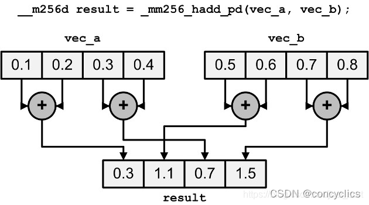
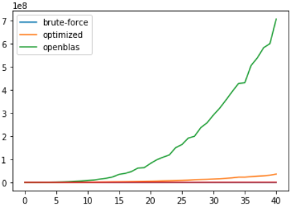

# CS205 Report#4
**姓名：** 刘啸涵
**SID：** 11911925

## Part1 问题描述
本项目旨在利用SIMD，MetaOperation等工具实现快速的矩阵乘法。给定的输入包含大尺寸（可能高达64K×64K）的矩阵；矩阵元素为随机生成。同时，还需和OpenBLAS比较运算速度。

在以往的学习过程中我们接触过一些针对矩阵优化的算法，如strassen算法等。大体思路是用加法换乘法，减少一定的浮点数运算次数。此外还有一些算法针对稀疏矩阵进行优化。

然而在本项目中存在下面几个问题：
1. 由于所有的矩阵都是随机生成，元素等于0的概率接近于0。在这种情况下，矩阵必然是稠密的。很多基于稀疏矩阵的优化算法并不可行。
2. 输入涉及到超大矩阵（64K×64K），很多使用分治法的算法（比如strassen）会很出现爆内存等问题。

为此，我们在代码实现时放弃了采用上述算法进行优化，而是选择采用了内存优化+SIMD+并行计算的方法进行优化。

## Part2 代码实现

**矩阵结构体及其创建和删除**

矩阵结构体实现如下：

```c
typedef struct {

    int row;
    int column;
    float* data;

} simple_mat;
```

创建矩阵时，可以使用`create_empty_matrix()`或`create_random_matrix()`来创建一个矩阵。函数会同时为矩阵结构体以及其数据分配内存。函数会返回一个`simple_mat`类型的指针。

```c
simple_mat* create_empty_matrix(int row, int column)
{
    simple_mat* p_mat = (simple_mat*) malloc (sizeof(simple_mat));

    p_mat -> row = row;
    p_mat -> column = column;
    p_mat -> data = (float*) malloc (row*column*sizeof(float));

    for(int i = 0 ;i < row*column; i++){
        p_mat -> data [i] =  0.0;
    }

    return p_mat;
}
```

而在删除时，则会同时释放两块内存，同时将传入指针置为NULL。

```c
void delete_matrix(simple_mat** pp_mat)
{
    float** pp_data = &((*pp_mat) -> data);
    free(*pp_data);
    free(*pp_mat);
    *pp_mat = NULL;
}
```

**优化的矩阵乘法**

- 转置

在我们的代码中，所有的矩阵都是以row-major形式存放的。这使得在进行乘法操作时，访问右边的同列矩阵元素时访问不到连续的内存。

我们的解决方案较为简单粗暴：先对右侧矩阵进行转置。这会带来很多额外开销（ $O(n^2)$ ), 但对总体效果依然是有益的。随后，在进行乘法时，两边的元素就都是连续的了。

- AVX

我们使用的是Intel平台。使用AVX进行加速。由于在上一步中，我们已经对内存的顺序进行了一些修正，在这里我们可以直接把矩阵内容塞给寄存器而不用再过一个buffer。

值得留意的是，由于本机的环境设置，在这里我们需要使用`_mm256_loadu_ps`来装载值至寄存器。原因是在程序中的值所处内存地址可能并不是256的整数倍。这可能会对效率造成一定影响，但由于时间关系我们没有修复。

此外，为了尽量多用AVX的指令来加速，我们使用了`_mm256_hadd_ps`来进行求和操作。函数的作用如下：

  

寄存器中毗邻的两个值会被求和，然后传入一个新的寄存器里。操作需要传入两个值，我们传入了一个纯零数组作为填充。在进行两次求和之后，我们即可取得结果。


```c
for(size_t k = 0; k < left_op->column - res; k += 8){
    __m256 left, right;
    __m256 result_buf_mem = _mm256_setzero_ps();
    float result_buf_arr[8] = {0};

    left  = _mm256_loadu_ps(left_op->data + i*left_op->column+k);
    right = _mm256_loadu_ps(right_op_transpose->data + j*right_op_transpose->column+k);
    result_buf_mem = _mm256_add_ps(result_buf_mem,_mm256_mul_ps(left, right));
    
    result_buf_mem = _mm256_hadd_ps(result_buf_mem,avx_zeros);
    result_buf_mem = _mm256_hadd_ps(result_buf_mem,avx_zeros);

    _mm256_storeu_ps(result_buf_arr, result_buf_mem);
    result->data[i*result_col+j] += (result_buf_arr[0] + result_buf_arr[4]);
    result_buf_mem = _mm256_setzero_ps();
}
```

由于数据必须八个八个存进寄存器，当矩阵长不是8的整数倍时势必会预留下一些无法使用AVX进行计算的数。这个部分我们会使用普通的矩阵乘法，挨个计算。经过测试我们发现，创建一个空数组，填充数字，再进行乘法的时间开销比直接遍历相乘要大。

```c
for(size_t k = left_op->column - res; k < left_op->column; k++){
    result->data[i*result_col+j] += 
        left_op->data[i*left_op->column+k] * right_op_transpose->data[j*right_op_transpose->column+k];
}
```

- OpenMP

此处所有循环都不涉及到资源抢占的问题，因此可以大胆地直接加并行的标记。

```c
#pragma omp parallel for
for(int i = 0; i < result_row; i++){

    #pragma omp parallel for
    for(int j = 0; j < result_col; j++){

        result->data[i*result_col+j] = 0.0;
        int res = left_op -> column % 8;
        
        #pragma omp parallel for
        for(size_t k = 0; k < left_op->column - res; k += 8){
            __m256 left, right;
            __m256 result_buf_mem = _mm256_setzero_ps();
            float result_buf_arr[8] = {0};

            left  = _mm256_loadu_ps(left_op->data + i*left_op->column+k);
            right = _mm256_loadu_ps(right_op_transpose->data + j*right_op_transpose->column+k);
            result_buf_mem = _mm256_add_ps(result_buf_mem,_mm256_mul_ps(left, right));
            
            result_buf_mem = _mm256_hadd_ps(result_buf_mem,avx_zeros);
            result_buf_mem = _mm256_hadd_ps(result_buf_mem,avx_zeros);

            _mm256_storeu_ps(result_buf_arr, result_buf_mem);
            result->data[i*result_col+j] += (result_buf_arr[0] + result_buf_arr[4]);
            result_buf_mem = _mm256_setzero_ps();
        }
        
        #pragma omp parallel for
        for(size_t k = left_op->column - res; k < left_op->column; k++){
            result->data[i*result_col+j] += 
                left_op->data[i*left_op->column+k] * right_op_transpose->data[j*right_op_transpose->column+k];
        }

    }
} 
```

**OpenBLAS的使用**

实现如下：

```c
simple_mat* matmul_BLAS(simple_mat* left_op, simple_mat* right_op)
{

    int result_row = left_op->row;
    int result_col = right_op->column;

    simple_mat* result = create_empty_matrix(result_row,result_col);

    int M = left_op->row;
    int N = right_op->column;
    int K = left_op->column;
    float alpha = 1;
    float beta = 0;
    int lda = M;
    int ldb = K;
    int ldc = N;

    cblas_sgemm(CblasRowMajor, CblasNoTrans, CblasNoTrans, M, N, K, alpha, left_op->data, lda, right_op->data, ldb, beta, result->data, ldc);

    return result;
    
}
```

根据文档，要调用OpenBLAS Level 3乘法（即矩阵乘法），则需使用`cblas_sgemm`。

我们希望学习OpenBLAS中高速乘法的实现方式，因此仔细阅读了其源代码。

为保障跨平台的泛用性以及速度，OpenBLAS在实现过程中大量使用了函数表，宏以及函数指针。这使得具体阅读非常困难。但我们总结到的大体思路如下：

首先，OpenBLAS处理矩阵的总体思路是分治：使用分块矩阵乘法和加法来提高效率。其次，在涉及到拆分、合并、小矩阵相乘法等基本操作时，则会使用平台对应的SIMD指令进行加速。由于矩阵形状存在很多差异，在分治过程中会产生非常多的特殊情况。针对这些情况，OpenBLAS都实现了特定函数进行处理。

在不同平台下，使用SIMD进行运算的支持放在了kernal目录下。根据平台OpenBLAS会使用不同方法搭配makefile进行编译。所有平台都应该实现了这些基本操作。


# 效果展示

  

单位为毫秒。可见优化后的算法显著快于原始暴力求解。


